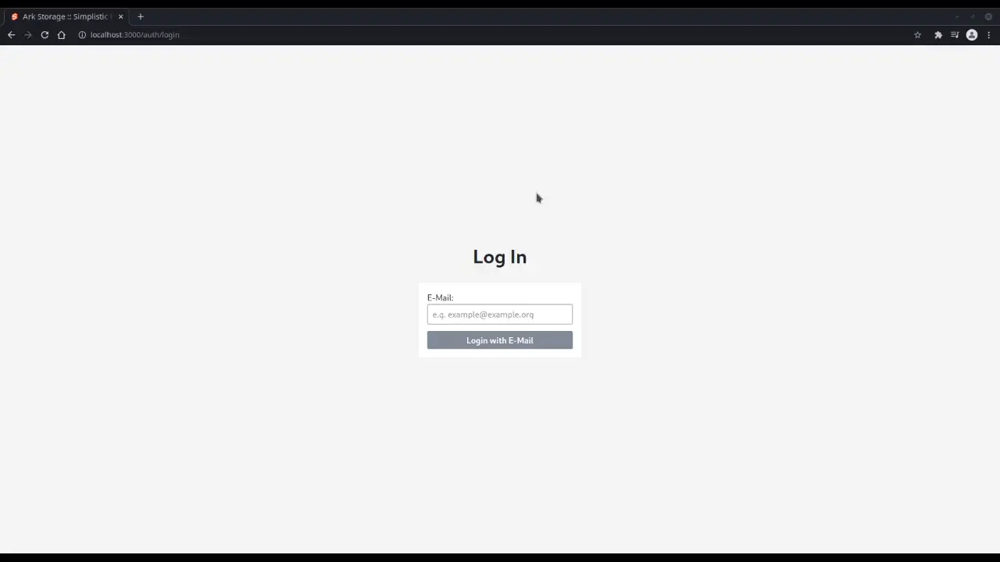
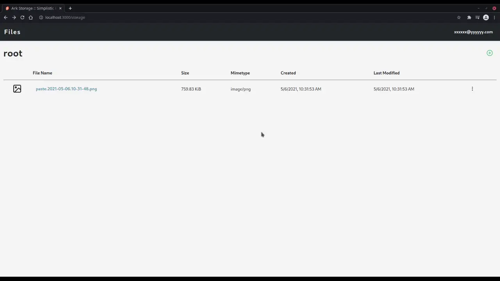

# Ark Storage

> Simple file hosting for quickly sharing things with others!

## Features

-   Image Paste
-   Drag 'n Drop Files to Upload
-   Upload Queue / Jobs
-   Simple in-Browser File Editing (Image Cropping)
-   Public File Sharing URLs

## UI Samples

> **NOTE**: My laptop is a bit slow with handling OBS, so there are some frame skips / animation loss

### Authentication

### Image Paste

### Upload Jobs / File Drop

### Simple File Actions

### Public File Sharing

